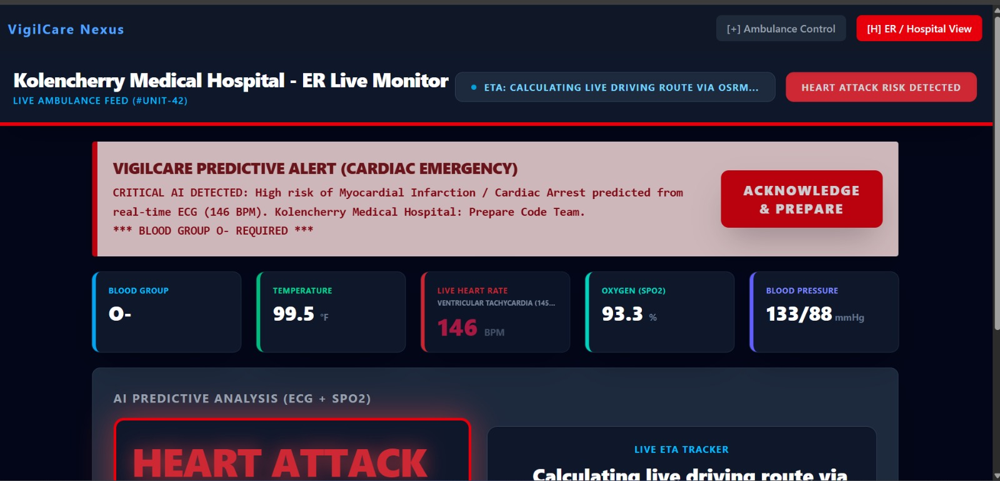
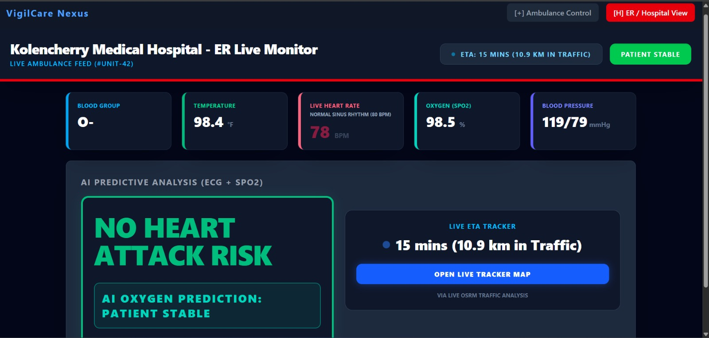
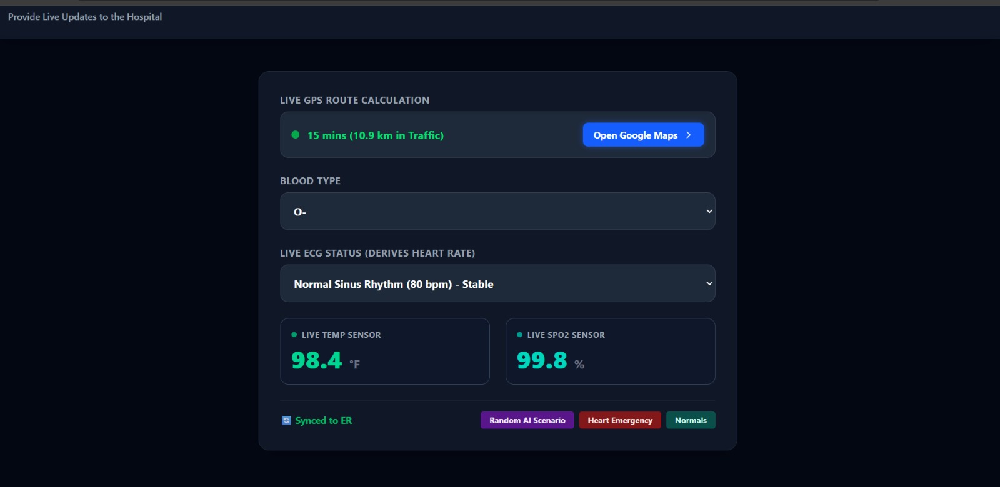

# 🚀 Welcome to NEXUS

### Conducted by | CLIQUE x ACM MITS |

### 📅 March 27 & 28

### 📍 Muthoot Institute of Technology and Science

<p align="center">
  
  
</p>

---

### 📖 Description

A **16-hour hackathon** across various domains where innovation meets execution. Build, collaborate, and push your limits.

---

## 🧠 Project Details (To be filled by participants)

```md
### 🏷️ Project Name:
VigilCare Nexus

### 🎯 Chosen Domain:
Digital Health & Predictive Care

### ❗ Problem Statement:
Hospitals often receive incomplete patient context from incoming ambulances, which delays triage and preparation. Routing decisions are also frequently static instead of adapting to nearby hospital options.

### 💡 Solution:
VigilCare Nexus provides a live ambulance-to-ER telemetry feed (vitals + AI risk flags) and dynamically suggests two nearby hospitals (suggested + alternative) ranked by ETA (OSRM + buffer). The ambulance dashboard can open Google Maps navigation for each route.
```

---

## ✨ Key Features

- Live ambulance → hospital updates over WebSocket
- AI-style triage alerts based on ECG/SpO2 + derived vitals
- Nearby hospital discovery (OpenStreetMap/Overpass) and ETA ranking (OSRM)
- Two distinct destinations shown on ambulance side: **Suggested** + **Alternate** (within 15km)

---

## 🖼️ Screenshots

<p align="center">
  
  
  
</p>

---

## ▶️ Run Locally

### Backend (FastAPI)

```sh
cd backend
python3 -m venv .venv
source .venv/bin/activate
python -m pip install -r requirements.txt
python -m uvicorn --app-dir "$PWD" main:app --host 0.0.0.0 --port 8002 --reload
```

### Frontend (Vite)

```sh
cd frontend
npm install
chmod -R u+x node_modules/.bin
npm run dev -- --host
```

Open:

- Frontend: `http://localhost:5173/`
- Backend: `http://localhost:8002/`

---

## 🎯 Hackathon Domains

Participants must choose **one** of the following domains:

1️⃣ Digital Asset Protection
2️⃣ Smart Supply Chains
3️⃣ Digital Health & Predictive Care
4️⃣ Climate Intelligence
5️⃣ Cybersecurity & Threat Intelligence

---

## ⚙️ Hackathon Workflow & Rules

To ensure fairness and transparency, we have designed a structured development and tracking system.

---

### 🔗 GitHub Template

👉 **Template Repo:** `{link}`

* All teams must **fork this repository**
* Fork name must follow:

```
<TeamId>_<TeamName>_ACMNexus26
```

* Example:

```
12_CodeWarriors_ACMNexus26
```

* You may rename the repository **after the event ends**

---


---

## 👥 Participation Rules

* Team Size: **2–4 members**
* **Pre-created projects are strictly not allowed**
* All work must be done **during the hackathon timeframe**
* Only registered team members must participate
* Do **not attack or interfere** with college infrastructure/network
* Follow all instructions from the organizing team

---

## 📁 Repository Structure


Repository must not be private. The template Repository includes:

```
AGENTS.md
README.md
CHANGELOG.md
/progress/
```

---

## ⏱️ Hourly Progress Requirements

Every hour, teams must:

* Make **at least one commit**
* Add **at least one progress update** inside `/progress/`

Progress can include:

* Screenshots
* Screen recordings
* Dataset snapshots
* Any meaningful proof of work

### 📂 Progress Format

```
/progress
1.png
2.png
3.png
```

* Files must be **numbered sequentially**
* Each file should reflect **actual development progress**

---

## 📝 Changelog Rules (VERY IMPORTANT)

Every commit must be reflected in `CHANGELOG.md`.

You can:

* Update it per commit, OR
* Update it periodically (but must be complete at the end)

---

### 📌 Changelog Format

```md
## HH:MM

### Features Added
- Added login functionality
- Implemented API integration

### Files Modified
- auth.js
- login.jsx

### Issues Faced
- Firebase auth errors
- API timeout issues
```

---

💡 Tip:
Instructions are already included in `AGENTS.md`.
You can simply prompt it to **"CREATE CHANGELOG"** to follow the format.

---

## 📖 Documentation

We have provided:

* Examples
* Guidelines

Inside:

* `AGENTS.md`
* `README.md`

Please follow them strictly.

---

## 🔍 Monitoring & Verification

* Random checks will be conducted during the hackathon
* Organizers may:

  * Inspect commit history
  * Review changelog consistency
  * Verify progress evidence

---

## 👨‍💻 Team Collaboration Rules

* All members must be added as **collaborators**
* By the end of the hackathon:

  * **Each member must have at least one commit**

---

## ⚠️ Disqualification Criteria

* Use of **pre-built / pre-developed projects**
* Fake or manipulated commit history
* Missing hourly commits or progress updates
* Incomplete or inconsistent changelog

---

## 🏁 Final Note

Focus on building, learning, and enjoying the experience.

---

🔥 **Build. Break. Innovate. See you at NEXUS.**
